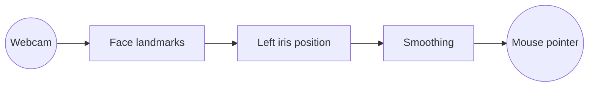

<div align="center">

# Eye Tracking

### A quieter way to move through a screen.

Track the movement of your left eye with an ordinary webcam and turn your gaze into a mouse position.

<p>
	<a href="./project/readme/eye-demo/index.html"><strong>Open the interactive eye demo</strong></a>
	&nbsp;&nbsp;·&nbsp;&nbsp;
	<a href="./project/readme/README.md">Read the full project guide</a>
</p>


</div>

---

## What it does

Eye Tracking uses OpenCV to read the webcam, MediaPipe to locate the face and left iris, and PyAutoGUI to move the pointer. The cursor target is smoothed in real time so the interaction feels calm instead of twitchy.



> **Try the visual idea:** the linked browser demo is a small JavaScript eye that follows your cursor. It is a safe, camera-free preview of the interaction. GitHub blocks JavaScript inside Markdown, so the demo opens as a separate local page instead of running inside this README.

## Start here

```powershell
cd project
python -m venv .venv
.\.venv\Scripts\Activate.ps1
python -m pip install -r requirements.txt
python main.py
```

The first run downloads the MediaPipe face-landmark model into `project/models/`. It is generated locally and excluded from Git.

| Control | Result |
| --- | --- |
| `P` | Pause or resume tracking |
| `Q` / `Esc` | Close the camera window |
| Screen corner | PyAutoGUI emergency stop |

## Tune it

```powershell
python main.py --camera 1
python main.py --smoothing 0.10
python main.py --width 1100
```

Lower smoothing values make the pointer steadier. If the default webcam is unavailable, try another camera index.

<details>
<summary><strong>Project structure</strong></summary>

```text
project/
|-- main.py
|-- requirements.txt
|-- readme/
|   |-- README.md
|   `-- eye-demo/
|       |-- index.html
|       |-- script.js
|       `-- styles.css
`-- .gitignore
```

</details>

<details>
<summary><strong>Privacy and safety</strong></summary>

Frames are processed in memory. The application does not record, upload, or save webcam footage. PyAutoGUI's corner fail-safe is enabled; pause the tracker before switching to another task.

</details>

<details>
<summary><strong>Current boundaries</strong></summary>

This is an interaction prototype, not a calibrated accessibility device. Results depend on lighting, camera placement, face visibility, and screen size. It currently tracks one left eye and moves the pointer; clicking, calibration, and dwell selection are not included.

</details>

## Documentation

- [Full project guide](./project/readme/README.md)
- [Interactive browser eye demo](./project/readme/eye-demo/index.html)
- [Python tracker](./project/main.py)

<div align="center">

Made as an eye-tracking interaction study.

</div>
