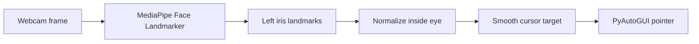

# Eye Tracking

> A hands-free mouse prototype controlled by the movement of your left eye.

[Open the interactive eye demo](./eye-demo/index.html)


## The idea

Eye Tracking turns a webcam into a simple human-computer interface. The program detects the iris in the user's left eye, measures where it sits inside the eye, and maps that position to the screen.

The pointer is smoothed before it moves, so small changes in gaze do not create distracting jumps. A live preview shows the detected iris and the current tracking state.

## See it in action

The small eye above is a JavaScript demonstration of the same interaction idea: move your cursor around the page and the iris follows it. It is intentionally lightweight and self-contained so it can be opened directly in a browser.

The real tracker uses the webcam and Python. The browser demo is only a visual explanation; it does not access the camera or move the system pointer.

## How it works



1. Open the webcam with OpenCV.
2. Detect one face and refine its facial landmarks with MediaPipe.
3. Read the four landmarks around the left iris.
4. Normalize the iris position against the eye's visible bounds.
5. Smooth the target coordinates.
6. Move the pointer through PyAutoGUI.

No webcam frame is saved to disk.

## Quick start

From the `project` folder:

```powershell
python -m venv .venv
.\.venv\Scripts\Activate.ps1
python -m pip install -r requirements.txt
python main.py
```

On the first run, the MediaPipe face-landmark model is downloaded into `models/`. The download is local, generated automatically, and excluded from Git.

### Controls

| Input | Action |
| --- | --- |
| `P` | Pause or resume tracking |
| `Q` or `Esc` | Quit the camera window |
| Move to a screen corner | Trigger PyAutoGUI emergency stop |

Useful options:

```powershell
python main.py --camera 1
python main.py --smoothing 0.12
python main.py --width 1100
```

## Project layout

```text
project/
|-- main.py                 # Webcam tracker and pointer control
|-- requirements.txt        # Python dependencies
|-- readme/
|   |-- README.md           # This documentation
|   `-- eye-demo/           # Browser-only visual demonstration
|       |-- index.html
|       |-- script.js
|       `-- styles.css
`-- .gitignore
```

## Troubleshooting

**The camera does not open**

Try another device index:

```powershell
python main.py --camera 1
```

Also check that another application is not using the webcam and that Windows camera permissions are enabled.

**The pointer feels too nervous**

Lower the smoothing value. A smaller value creates slower, steadier movement:

```powershell
python main.py --smoothing 0.10
```

**The pointer does not reach the edges**

Move your head into a comfortable position, keep the eye visible, and look farther toward the edge of the eye. Good, even lighting improves landmark stability.

**The model download fails**

Run the program again with an internet connection. The model only needs to be downloaded once.

## Safety and privacy

This prototype takes control of the system pointer, so pause it before switching to another task. PyAutoGUI's corner fail-safe is enabled. The application processes frames in memory and does not record, upload, or store webcam footage.

## Current limits

This is an interaction prototype, not a calibrated accessibility device. Accuracy depends on lighting, camera position, face visibility, and screen size. It currently tracks one user's left eye and moves the pointer; clicking, calibration, and dwell selection are not implemented yet.

## License

Add the license that matches your project before publishing a public release.
